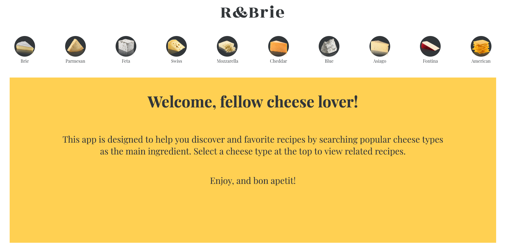
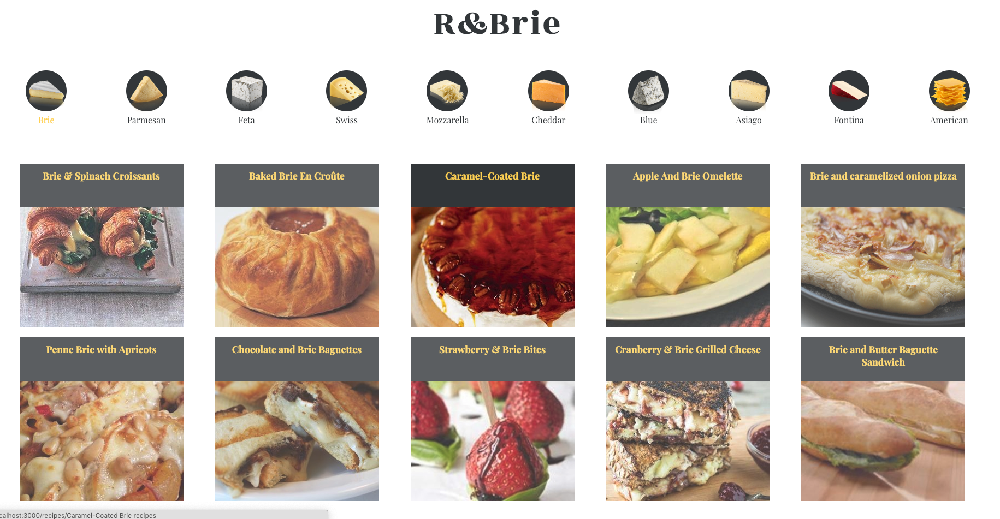
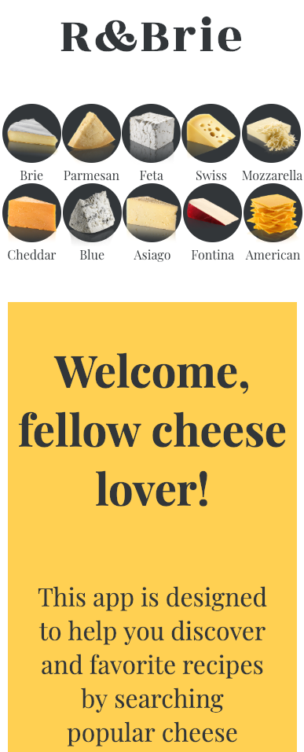

# **R&BRIE**

R&BRIE is a web based application built in React that allows the user to search and view recipes by popular cheese types. Users can also leave comments and rate recipes. Recipe data is fetched and populated from [The Edamam API](https://developer.edamam.com/). This project was designed as a final assessment binary challenge at Turing School of Software & Design. I was assigned an API and end user type and tasked with creating an app that delivers a unique product for my audience, given the constraints. 

### Installation and Setup Instructions

```
Go to https://developer.edamam.com/ to request a recipe search API key
```

Clone this repo and then type the following commands in your terminal: 

```
$ git clone https://github.com/TMcMeans/R-and-Brie

cd into the 'r-and-brie' repository on your local machine

$ npm install     // install dependencies 

$ npm start   // start running the app in localhost 

$ npm test    // to view passing tests 

```

### Project Goals

My goal for this project were to: 
- Utilize The Edamam API to fetch, store and display recipe data
- Build UI that allows for a unique experience for my end user- foodies
- Use React Router to add routing capability and navigation to different areas of the app
- Integrate Redux architecture as a global state management tool to access and store data
- Employ test driven development (TDD) in production of the app and provide full test coverage for all aspects including async functionality and Redux

### Lead Developer

Tanj McMeans- [Github](https://github.com/TMcMeans)

### Technologies and Resources

- React
- React Router
- Redux
- Redux Thunks/Middleware
- Enzyme/Jest
- REST API
- HTML5
- SCSS
- Git 
- Github

### Original Wireframe


### Implementation







