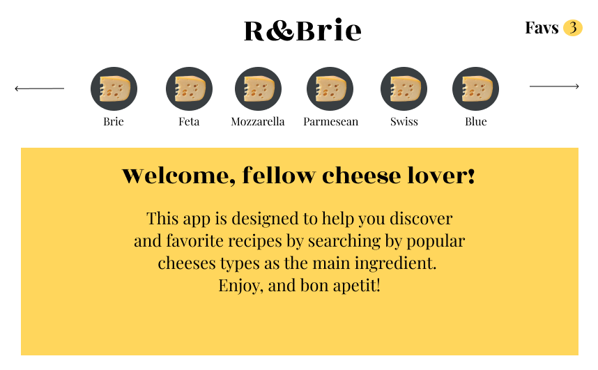
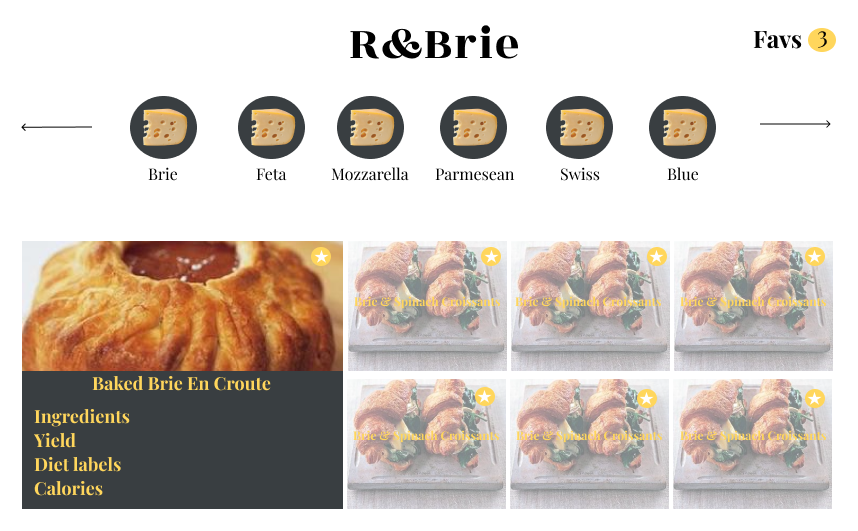
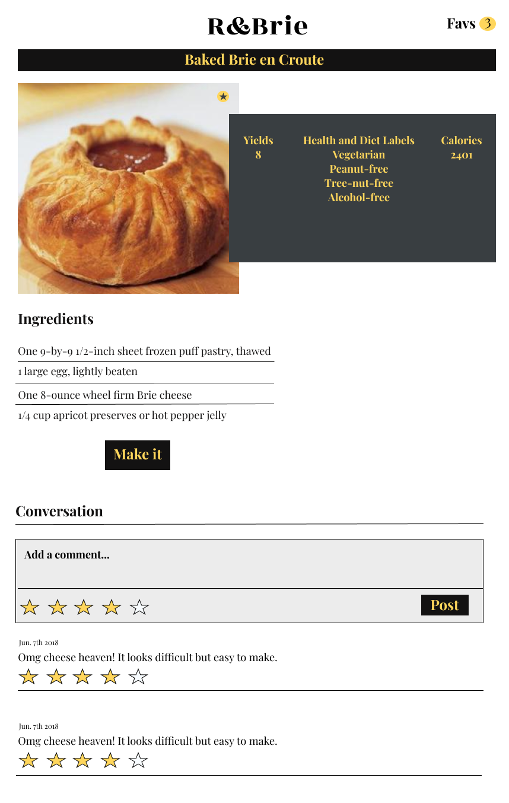
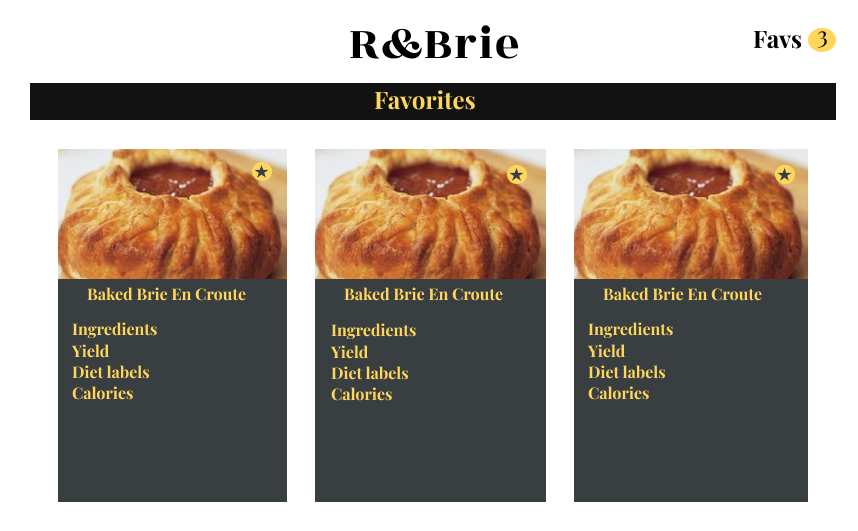
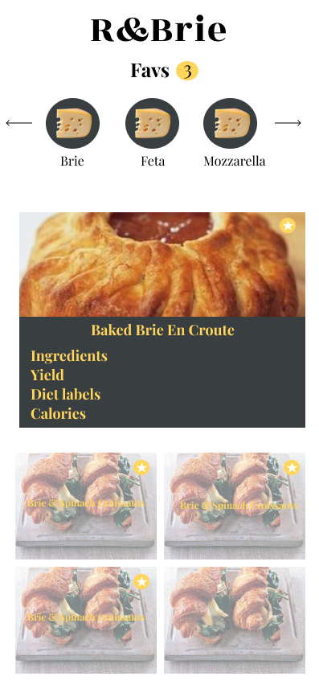

# **R&BRIE**

R&BRIE is a web based application built in React.

### Installation and Setup Instructions

```

```

### Project Goals

My goal for this project is to:

### Lead Developer

Tanj McMeans- [Github](https://github.com/TMcMeans)

### Technologies and Resources

- React
- React Router
- Redux
- Redux Thunks/Middleware
- Enzyme/Jest
- REST API
- HTML5
- SASS
- Git Rebase Workflow
- Github

### Original Wireframe












### Implementation
